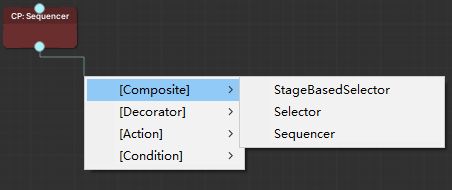

# BehaviorTreeWithXNode

## 树

行为树可以认为是模拟人类决策，将决策以树形结构组织而形成的树。

行为树的节点大致可分为控制流节点和执行节点，控制流节点实现决策即分支选择，执行节点则实现具体行为。

每次运行都会从根节点开始遍历树，以得到当前上下文的决策结果。

与状态机相比，节点不需要维护向其他节点的转换，由父节点类型决定控制逻辑。

### 组合节点（Composites）
组合节点可以拥有一个或多个子节点的节点，并按照特定规则访问子节点。
#### 序列节点
遍历子节点。若任意一个子节点返回失败，则立即返回失败；或所有子节点返回成功，则返回成功。
#### 选择节点
遍历子节点。若任意一个子节点返回成功，则立即返回成功；或所有子节点返回失败，则返回失败。
### 修饰节点（Decorator）
修饰节点只能拥有一个子节点，它会转换子节点返回的状态，并可能会对子节点进行控制。（例如停止或重复运行）
#### 取反节点
反转其子节点的结果并返回。
#### 重复节点
重复执行子节点。
### 条件节点（Conditinals）
判断条件是否成立。   （可认为是为符合单一职责原则,将行为节点的准入条件提取出来了。  不同实现可能不一样或者没有）
### 行为节点（Action）
叶子节点，实现具体行为。

### 上下文和黑板
用以存储多个树节点需要用到的变量，让节点之间可以间接交流。

## 可视化编辑
基于XNode实现可视化编辑    (不能可视化编辑的行为树就是答辩。   如果你也用代码构建过复杂树就一定会明白我的心情。。。)

### 使用

1. 创建BehaviourTreeGraph:Project窗口右键->Create->BehaviourTreeGraph
2. 构建树：右键或直接拖拽出链接会弹出节点菜单

   

3. 给要控制的GameObject添加BehaviourRunner组件，并指定BehaviourTreeGraph

### 扩展
继承Composite、Decorator、Condition、Action节点，实现自己的节点即可。 自定义节点会被收集到对应的菜单里。

### 序列化
XNode节点继承自ScriptableObject，可以直接序列化到Asset中。

## 空洞骑士Boss战复现

